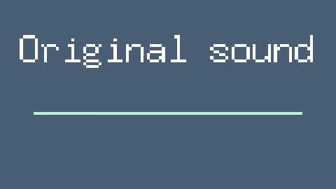

# sound-viz

Sometimes you need to create a video that presents several different sounds, for example to show off an audio-generating neural network on Twitter. For example, you might want a screen that says "original sound" that plays some audio recording, then a screen that says "converted sound" with a different audio recording. To make the videos more interesting, you might also want to show audio waves corresponding to the sounds.



This tool automatically creates videos from a series of captioned audio files. For example, this will create a file `compilation.mp4` from two audio files:

```
$ go run . -output compilation.mp4 "Caption 1" file1.wav "Caption 2" file2.wav
```

See `go run . -help` for more flags and usage info.
